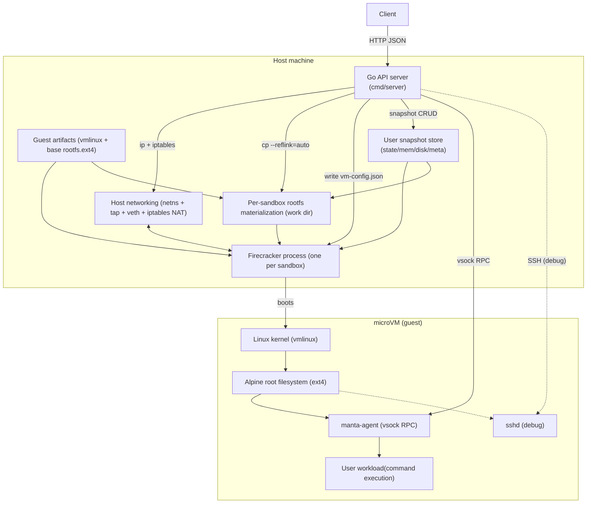
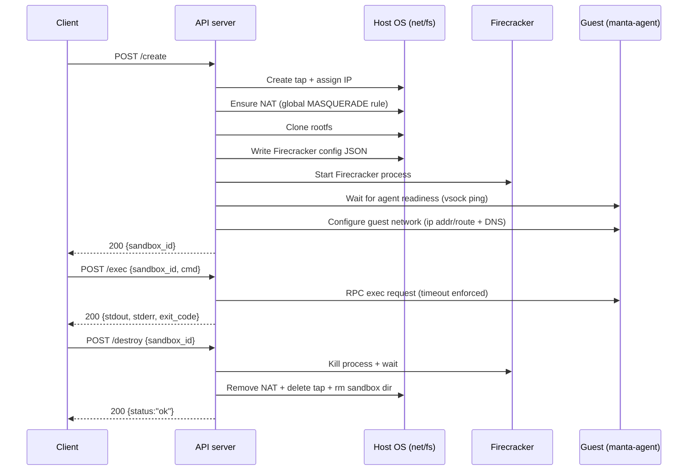
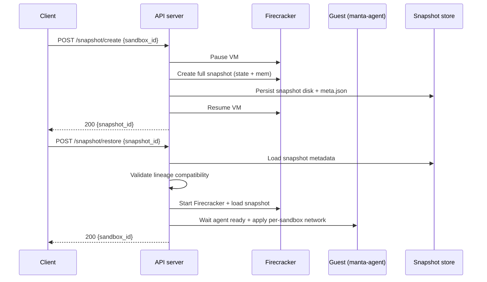

# Manta Architecture

This document explains the architecture and key components of Manta, a minimal cloud sandbox provider built on Firecracker microVMs.

## Cloud Sandbox Provider

A cloud sandbox provider gives users on-demand isolated Linux environments via an API. The user calls "create," gets a sandbox, runs commands in it, and destroys it when done. The sandbox runs on the provider's infrastructure, not the user's machine.

A sandbox must:

- **Be isolated.** One user's sandbox cannot see or affect another's, or the host machine.
- **Be general purpose.** Users can run arbitrary commands, scripts, and programs. Install packages. Make network requests. It behaves like a real Linux machine.
- **Be remote.** A real network separates the user from the sandbox.
- **Be programmatic.** Create, use, and destroy via API calls.

## Goal

Manta provides a small remote API for sandbox lifecycle and user snapshots:

- `POST /create` -> boot a sandbox VM and return `sandbox_id`
- `POST /exec` -> run a command inside that VM
- `POST /destroy` -> tear down VM and host resources
- `POST /snapshot/create` -> capture a user snapshot from a running sandbox
- `POST /snapshot/restore` -> create a new sandbox from a user snapshot
- `GET /snapshot/list` -> list user snapshots
- `POST /snapshot/delete` -> delete a user snapshot

## High-Level Architecture

At a high level, this is a single-host control plane plus one microVM per sandbox:

- **Control plane:** Go HTTP server in `cmd/server/main.go`
- **Isolation runtime:** Firecracker process per sandbox
- **Guest OS artifacts:** shared kernel + base rootfs image
- **Per-sandbox writable disk:** rootfs materialized per VM (clone strategy controlled by config)
- **Command transport:** vsock RPC to an in-guest agent (default); SSH is kept for debugging
- **Network path:** per-sandbox host tap device + tiny `/30` subnet + host NAT (`iptables MASQUERADE`) for outbound internet access
- **Host isolation:** each sandbox runs Firecracker in a per-sandbox network namespace (netns) so stable device names like `tap0` can be reused safely

### Architecture Diagram

### Data Flow Diagram (Create/Exec/Destroy)

### Data Flow Diagram (User Snapshot Create/Restore)

### Request/Execution Path

1. Client calls `POST /create`
2. Server allocates host networking (tap + `/30` subnet + NAT)
3. Server clones rootfs for sandbox
4. Server writes Firecracker config JSON (including vsock device)
5. Server starts Firecracker process
6. Server waits for agent readiness in guest (vsock ping)
7. Server configures per-sandbox guest networking via agent
8. Server returns `sandbox_id`
9. Client calls `POST /exec` with command
10. Server sends exec request to agent and returns stdout/stderr/exit code
11. Client calls `POST /destroy`
12. Server kills VM process and cleans networking + files

### User Snapshot Path

1. Client calls `POST /snapshot/create` with `sandbox_id`
2. Server pauses VM and asks Firecracker to create full snapshot files (`state.snap`, `mem.snap`)
3. Server persists a snapshot disk image and writes snapshot metadata (`meta.json`)
4. Server resumes VM and returns `snapshot_id`
5. Client calls `POST /snapshot/restore` with `snapshot_id`
6. Server loads metadata and validates snapshot lineage compatibility
7. Server materializes per-sandbox writable disk from snapshot disk, starts Firecracker, and loads snapshot
8. Server waits for agent readiness, applies per-sandbox guest network config, and returns new `sandbox_id`

## Key Components

### API Server (`cmd/server/main.go`)

This is the control plane and orchestration layer.

Responsibilities:

- Validates environment and prerequisites (`/dev/kvm`, artifacts, Firecracker binary)
- Exposes HTTP APIs (`/create`, `/exec`, `/destroy`, `/snapshot/*`, `/healthz`)
- Maintains in-memory sandbox map and IDs
- Runs host commands for network setup and cleanup
- Starts/stops Firecracker processes
- Handles agent readiness (vsock ping), command execution (vsock RPC), and snapshot lifecycle metadata

### Firecracker Runtime

Each sandbox is backed by one Firecracker process. This provides stronger isolation than containers (separate guest kernel per sandbox).

Responsibilities:

- Boots a microVM from supplied kernel + rootfs config
- Attaches virtual network device to host tap
- Runs isolated guest kernel/userspace

### Guest Kernel (`guest/build-kernel.sh`)

Single reusable `vmlinux` artifact, built with Firecracker-compatible config.

Why required:

- Firecracker needs a Linux kernel image to boot every VM.
- Reusing one kernel artifact keeps the system simple.

### Guest Rootfs (`guest/build-rootfs.sh`)

Builds Alpine-based `rootfs.ext4` and SSH key artifacts. This provides the root filesystem that contains the userspace programs and config the kernel will run after it finishes booting.

What it includes:

- OpenRC init setup
- `manta-agent` (vsock RPC server) enabled on boot
- `openssh-server` (debug access)
- Base utilities + optional tooling (`python3`, `nodejs`, `npm`, etc.)
- `iproute2` for runtime network configuration

### Per-Sandbox Rootfs Materialization

On each create/restore, Manta materializes a sandbox-specific writable disk from a source rootfs/snapshot disk:

- `cp --reflink=auto ...` (default clone mode)
- `cp --reflink=always ...` when `MANTA_ROOTFS_CLONE_MODE=reflink-required`

Why required:

- Each VM needs writable disk state isolated from other VMs.
- Clone mode guardrail avoids silent full-copy fallback on non-reflink filesystems when strict mode is enabled.

### Snapshot Stores and Lineage

Manta currently uses two snapshot stores:

- **Golden snapshot store** under `${MANTA_WORK_DIR}/snapshot` for fast `/create` baseline restores.
- **User snapshot store** under `${MANTA_WORK_DIR}/user-snapshots/<snapshot_id>` containing:
  - `state.snap`
  - `mem.snap`
  - `disk.ext4`
  - `meta.json`

Snapshot restore validates lineage metadata before restore to avoid loading snapshots against incompatible base/rootfs lineage.

### Agent Command Channel (vsock RPC)

`/exec` sends an RPC request over Firecracker vsock to an in-guest agent which runs the command and returns stdout/stderr/exit code.

Why required:

- It avoids SSH handshake overhead and makes readiness deterministic.
- It enables post-boot configuration (like per-sandbox networking) without mutating the rootfs image on disk.

Trade-off:

- Requires a small amount of custom code inside the guest (the agent binary and init service).

### Host Networking Layer

Per sandbox:

- network namespace (netns) which contains the sandbox tap and Firecracker process
- tap device (`tap0` inside the sandbox netns)
- veth pair connecting the sandbox netns to the root namespace (routing boundary)
- private `/30` subnet (`172.16.X.0/30` pattern)
- host IP (`.1`) and guest IP (`.2`)
- NAT rule via iptables `MASQUERADE` on host egress interface (installed once, shared)

What this means:

- **netns (per-sandbox):** a Linux network namespace. Running Firecracker inside a per-sandbox netns allows each sandbox to reuse stable interface names (like `tap0`) without collisions.
- **tap device (per-sandbox):** a host-side virtual Ethernet interface created for a single microVM. Firecracker attaches the VM's virtual NIC to this tap. The tap lives inside the sandbox netns.
- **veth pair:** a linked pair of virtual Ethernet interfaces which connects the sandbox netns back to the root namespace so guest traffic can be routed and NATed out to the internet.
- **`/30` subnet:** CIDR mask `255.255.255.252` (4 IPs total, 2 usable). Manta uses it like a point-to-point link:
  - subnet: `172.16.X.0/30`
  - host (tap) IP: `172.16.X.1`
  - guest IP: `172.16.X.2`
- **`iptables MASQUERADE`:** source NAT for outbound traffic. When the guest sends packets to the internet from `172.16.X.2`, the host rewrites the source IP to the host's egress IP so replies can return and be mapped back to the guest connection.

Host vs guest configuration:

- **On the host:** create the tap, assign the host IP, enable IPv4 forwarding, and add/remove the NAT rule.
- **In the guest (microVM):** the network interface still needs configuration (IP address, netmask, default gateway, DNS). Manta configures this post-boot via vsock RPC by running `ip addr/route` commands in the guest through the agent.

Why required:

- Guest workloads need outbound network access.

## Benchmarks

- Baseline create/exec benchmark history: `docs/benchmark-results.md`
- User snapshot restore benchmark history: `docs/snapshot-benchmark-results.md`

## Current Limitations

- Snapshot storage is local to a single host/workdir (no cross-host mobility yet).
- No multi-tenant authz model is enforced for snapshot APIs yet.
- No quotas/retention policies for snapshot growth are enforced yet.
