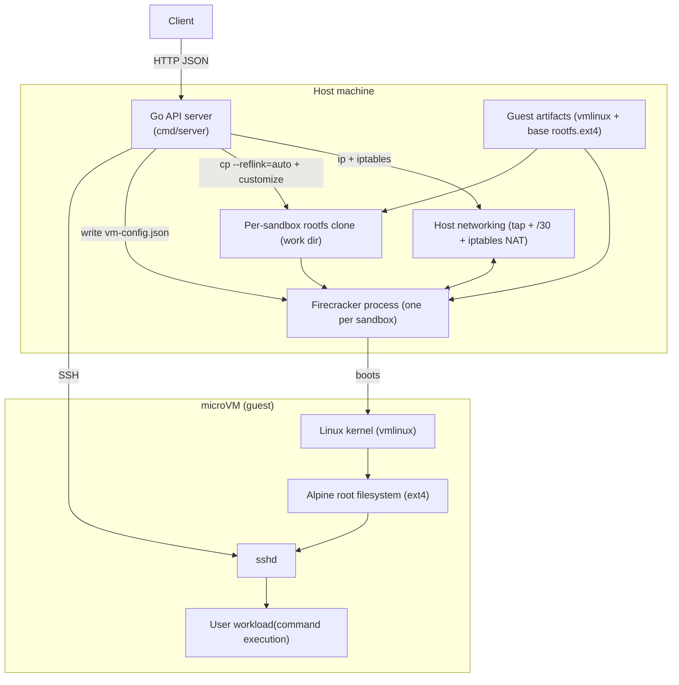
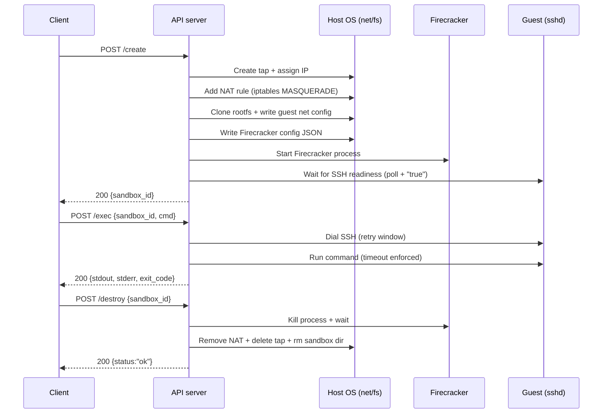

# Manta Architecture

This document explains the architecture and key components of Manta, a minimal cloud sandbox provider built on Firecracker microVMs.

## Cloud Sandbox Provider

A cloud sandbox provider gives users on-demand isolated Linux environments via an API. The user calls "create," gets a sandbox, runs commands in it, and destroys it when done. The sandbox runs on the provider's infrastructure, not the user's machine.

A sandbox must:

- **Be isolated.** One user's sandbox cannot see or affect another's, or the host machine.
- **Be general purpose.** Users can run arbitrary commands, scripts, and programs. Install packages. Make network requests. It behaves like a real Linux machine.
- **Be remote.** A real network separates the user from the sandbox.
- **Be programmatic.** Create, use, and destroy via API calls.

## Goal

Manta provides a very small remote API for sandbox lifecycle:

- `POST /create` -> boot a sandbox VM and return `sandbox_id`
- `POST /exec` -> run a command inside that VM
- `POST /destroy` -> tear down VM and host resources

## High-Level Architecture

At a high level, this is a single-host control plane plus one microVM per sandbox:

- **Control plane:** Go HTTP server in `cmd/server/main.go`
- **Isolation runtime:** Firecracker process per sandbox
- **Guest OS artifacts:** shared kernel + base rootfs image
- **Per-sandbox writable disk:** cloned rootfs per VM
- **Command transport:** SSH from host control plane into guest
- **Network path:** per-sandbox host tap device + tiny `/30` subnet + host NAT (`iptables MASQUERADE`) for outbound internet access

### Architecture Diagram

### Data Flow Diagram

### Request/Execution Path

1. Client calls `POST /create`
2. Server allocates host networking (tap + `/30` subnet + NAT)
3. Server clones rootfs for sandbox and writes guest network config
4. Server writes Firecracker config JSON
5. Server starts Firecracker process
6. Server waits for SSH readiness in guest
7. Server returns `sandbox_id`
8. Client calls `POST /exec` with command
9. Server dials SSH, executes command, returns stdout/stderr/exit code
10. Client calls `POST /destroy`
11. Server kills VM process and cleans networking + files

## Key Components and Why They Exist

### API Server (`cmd/server/main.go`)

This is the control plane and orchestration layer.

Responsibilities:

- Validates environment and prerequisites (`/dev/kvm`, artifacts, Firecracker binary)
- Exposes HTTP API (`/create`, `/exec`, `/destroy`, `/healthz`)
- Maintains in-memory sandbox map and IDs
- Runs host commands for network setup and cleanup
- Starts/stops Firecracker processes
- Handles SSH readiness and command execution

### Firecracker Runtime

Each sandbox is backed by one Firecracker process. This provides stronger isolation than containers (separate guest kernel per sandbox).

Responsibilities:

- Boots a microVM from supplied kernel + rootfs config
- Attaches virtual network device to host tap
- Runs isolated guest kernel/userspace

### Guest Kernel (`guest/build-kernel.sh`)

Single reusable `vmlinux` artifact, built with Firecracker-compatible config.

Why required:

- Firecracker needs a Linux kernel image to boot every VM.
- Reusing one kernel artifact keeps the system simple.

### Guest Rootfs (`guest/build-rootfs.sh`)

Builds Alpine-based `rootfs.ext4` and SSH key artifacts. This provides the root filesystem that contains the userspace programs and config the kernel will run after it finishes booting.

What it includes:

- OpenRC init setup
- `openssh-server`
- Base utilities + optional tooling (`python3`, `nodejs`, `npm`, etc.)
- Network interface defaults and DNS

### Per-Sandbox Rootfs Clone

On each create, Manta copies the base rootfs to a sandbox-specific file using:

- `cp --reflink=auto ...`

Then it customizes network config inside that copy.

Why required:

- Each VM needs writable disk state isolated from other VMs.

### SSH Command Channel

`/exec` uses SSH to run a command in guest and return outputs.

Why required:

- It avoids building a custom guest agent protocol in the minimum version.
- SSH is battle-tested and easy to integrate from Go.

Trade-off:

- Extra handshake and protocol overhead vs specialized agents.

### Host Networking Layer

Per sandbox:

- tap device (`tap-sb-*`)
- private `/30` subnet (`172.16.X.0/30` pattern)
- host IP (`.1`) and guest IP (`.2`)
- NAT rule via iptables `MASQUERADE` on host egress interface

What this means:

- **tap device (per-sandbox):** a host-side virtual Ethernet interface created for a single microVM. Firecracker attaches the VM's virtual NIC to this tap, giving the host a direct L2 link to the guest (used for SSH and for routing guest traffic).
- **`/30` subnet:** CIDR mask `255.255.255.252` (4 IPs total, 2 usable). Manta uses it like a point-to-point link:
  - subnet: `172.16.X.0/30`
  - host (tap) IP: `172.16.X.1`
  - guest IP: `172.16.X.2`
- **`iptables MASQUERADE`:** source NAT for outbound traffic. When the guest sends packets to the internet from `172.16.X.2`, the host rewrites the source IP to the host's egress IP so replies can return and be mapped back to the guest connection.

Host vs guest configuration:

- **On the host:** create the tap, assign the host IP, enable IPv4 forwarding, and add/remove the NAT rule.
- **In the guest (microVM):** the network interface still needs configuration (IP address, netmask, default gateway, DNS). Manta writes this into the per-sandbox rootfs during create (e.g. `/etc/network/interfaces` and `/etc/resolv.conf`) so the guest boots with `eth0` configured and a default route via the host tap IP.

Why required:

- Control plane needs a path to reach guest SSH.
- Guest workloads need outbound network access.

## The Bare Minimum

For a single-host sandbox provider simulation, this is close to the minimum practical stack:

- API surface for lifecycle
- VM-based isolation primitive
- Bootable guest image
- Remote command execution path
- Basic per-sandbox networking and cleanup
- Measurement loop

This is enough to simulate the core product behavior: "Create sandbox -> run arbitrary command -> destroy sandbox". It simply proves the core lifecycle and provides the benchmark baseline.
