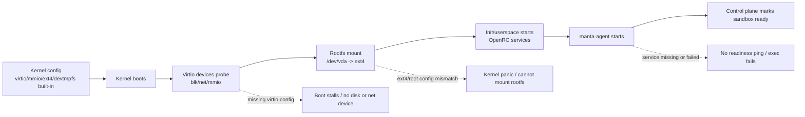
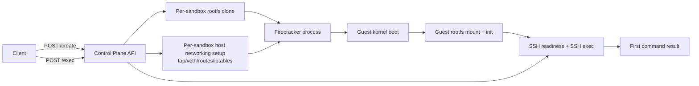
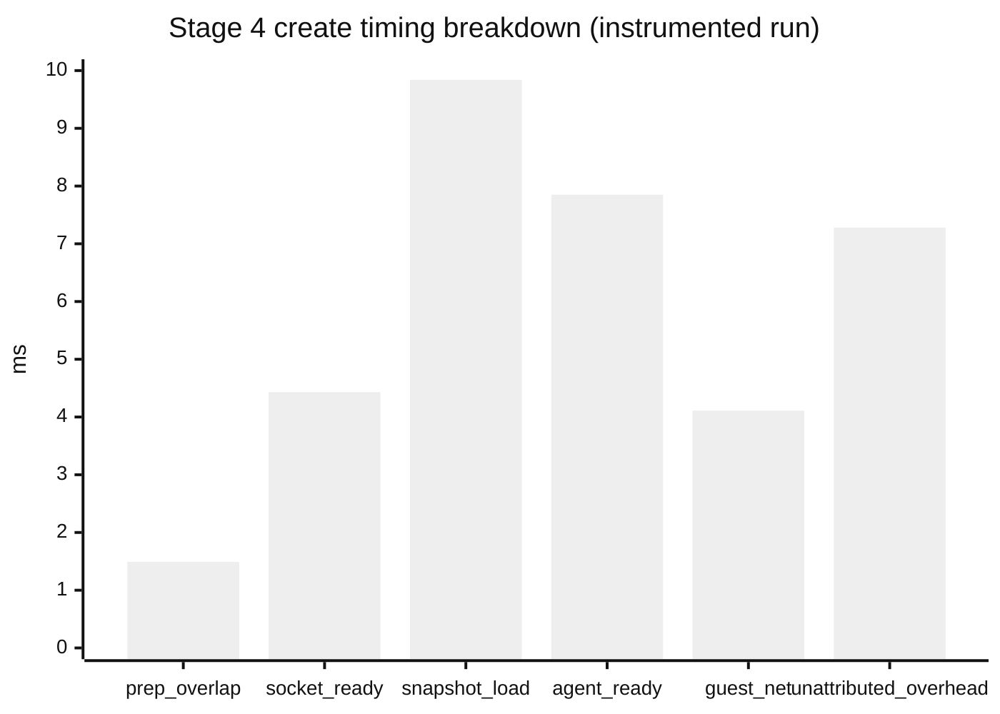
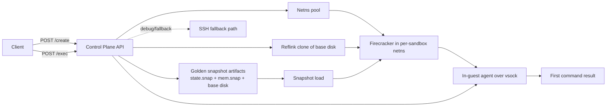

# Optimizing a Firecracker Control Plane

Sandboxes are immensely useful in the AI era, especially for iterating on untrusted AI-generated code. While sandbox boot times are not usually not the key latency bottleneck for autonomous agents, I often think about a world where agents branch themselves rapidly in sandboxes for parallel exploration of solution spaces in large, ambiguous tasks, where compute infra, not LLM inference, is the limiting factor for latency. Recently, inspired by the ComputeSDK sandbox benchmarks, and also to peek under the hood for these incredible systems which I use on a daily basis, I went down the rabbit hole of optimizing latencies for a sandbox orchestrator.

The first version of this system was "working" in the most literal sense. You could create a sandbox, run a command, and destroy it. On paper, that is success. In practice, it took **2.725 seconds p95** to go from `POST /create` to the first successful `POST /exec`, and that is slow enough to break flow in any interactive product.

By the end of this iteration cycle, the same metric landed at **59.030ms p95**. This post focuses on the system-level decisions behind each step, why they worked, and what the failures taught me.

Throughout this post, "TTI" means:

**TTI = `/create` (booting up a sandbox to a "ready" state) + first `/exec`** (executing a simple `echo` command).

Here, "ready" means the in-guest agent responds to ping and guest network configuration has completed such that the sandbox can make outbound requests. Sandbox tear-downs are excluded from the measurements.

## Benchmark environment

All numbers in this post were collected on one development laptop (Thinkpad T14 Gen 4):

- OS/kernel: Fedora Linux (`6.18.13-200.fc43.x86_64`)
- CPU: 13th Gen Intel Core i5-1345U (`12` logical CPUs)
- Memory: `30GiB` RAM
- Firecracker: `v1.13.1`
- Virtualization: KVM enabled
- Workdir filesystem: `btrfs` (`/home/...`)
- Note on `/tmp`: mounted as `tmpfs` on this machine, which matters for reflink behavior

One deliberate scope choice: this journey excludes warm VM pools. I wanted the benchmark to answer a narrower question: how much of the boot/bring-up path can be optimized when every request starts from a cold create. That keeps each improvement attributable to control-plane and microVM boot work, instead of pool hit-rate behavior. In production, warm pools still make sense for burst absorption and tail latency, but a faster cold path means you can operate with a smaller pool and recover faster when demand outpaces pre-warmed capacity.

## Firecracker microVMs

MicroVMs are often described as "between containers and VMs". True, but too vague to be useful for design decisions.

Containers are fast partly because they share the host kernel. Traditional VMs isolate more strongly but often pay for broad virtual hardware emulation and long boot paths. Firecracker's microVM model narrows the machine surface intentionally: minimal devices, clear API, strong isolation boundary.

Firecracker gives you a strong foundation, but your control plane architecture determines whether that potential turns into low latency.

## Where the latency actually lived

At the API layer, the control plane is tiny:

- `POST /create`
- `POST /exec`
- `POST /destroy`

Underneath, `/create` is a pipeline:

1. prepare per-sandbox storage
2. provision host networking
3. start Firecracker
4. wait for guest readiness
5. make first command path usable

Once Firecracker itself was reasonably configured, most latency came from surrounding orchestration: cold-boot frequency, readiness modeling, repeated host setup per request, and accidental serialization in the control path.

That changed how I approached optimization. Instead of tuning one function at a time, I treated `/create` as a staged critical path and asked two questions for each stage:

- can this stage be removed?
- if not, can this stage be amortized or overlapped?

## Making the guest deterministic

One critical part of this project was the kernel and rootfs bring-up. For readers who do not work on Linux internals every day: the **kernel** is the core OS binary that boots first and controls CPU/memory/devices; the **rootfs** is the guest disk image that contains user-space binaries, libraries, init scripts, and services (like SSH or the in-guest agent). A guest needs both for different reasons: without a kernel, the VM has no operating system core to boot or talk to virtual devices; without a rootfs, the kernel can boot but has no user-space environment to start processes, run commands, or expose services. Getting both right is a prerequisite for everything else.

You cannot optimize latency on top of an unstable guest substrate, because every regression looks like a performance issue when it is actually a boot correctness issue.

### Kernel build

Firecracker expects a kernel that boots cleanly in a minimal virtio-centric environment. If key options are wrong, symptoms look chaotic: rootfs mount failures, virtio probe failures, guest services never coming up, and control-plane timeouts that look "network-related" but are actually boot-related. A useful mental model is: if the kernel cannot discover and mount virtual devices, the VM may start, but nothing "higher level" can become ready.

Concretely, `guest/build-kernel.sh` starts from Firecracker's own microVM CI config (`microvm-kernel-ci-x86_64-6.1.config`) and then applies a small set of explicit overrides with `scripts/config` before building `vmlinux`. Starting from Firecracker's config gives a known-good baseline aligned with Firecracker's minimal device model; the overrides lock in behavior needed for this specific control-plane path and avoid host-to-host drift.

The main overrides do three things:

- force boot-critical paths to be built-in (for example `CONFIG_VIRTIO_BLK`, `CONFIG_VIRTIO_NET`, `CONFIG_VIRTIO_MMIO`, `CONFIG_EXT4_FS`, `CONFIG_DEVTMPFS[_MOUNT]`) so the guest can mount rootfs and configure networking without relying on optional runtime module loading
- remove features that are unnecessary for this microVM workload or can introduce surprises (`CONFIG_MODULES=n`, `CONFIG_BLK_DEV_INITRD=n`, `CONFIG_ACPI=n`)
- trim debug/strictness settings (`CONFIG_DEBUG_KERNEL=n`, `CONFIG_KALLSYMS=n`, `CONFIG_WERROR=n`) so build/runtime behavior is more predictable for repeatable benchmark runs

In short, Firecracker's config is the compatibility baseline, and the overrides are workload-specific guardrails for deterministic boot and readiness.

So the kernel work here was essentially enforcing boot-critical invariants:

- storage/network virtio support available at boot
- root filesystem support available at boot
- no accidental dependence on modules for critical boot path

Once that was stable, boot behavior became boring and predictable. Only then did benchmark numbers become trustworthy.

### Rootfs build

I moved to a deterministic rootfs assembly model based on staged minirootfs extraction and ext4 image construction. Think of rootfs as the VM's "application filesystem": it is where `/bin/sh`, package-managed binaries, startup services, and my guest agent actually live. The practical reason for this build flow was consistency across hosts and fewer container-runtime-specific surprises during image creation.

In `guest/build-rootfs.sh`, this is implemented as: construct the filesystem tree in a staging directory, install/enable required services there (notably `sshd` and `manta-agent`, which is key later on), then materialize a sealed ext4 image with `mkfs.ext4 -d`. Two details are easy to miss but important. First, pseudo-filesystems (`/proc`, `/sys`, `/dev`) are unmounted before `mkfs -d`, so runtime pseudo state is not accidentally captured or used during image population. Second, the artifact is intentionally slimmed (`resize2fs -M`, plus cache/docs/manpage cleanup), which reduces IO and helps clone/restore latency in the hot path. This also maps well to production: deterministic image assembly and smaller runtime artifacts are usually beneficial, as long as version pinning and debug-image variants are handled explicitly.

The performance reason was secondary but important: unstable artifacts introduce noise. If your base image setup is non-deterministic, every latency chart is suspect.

Putting kernel and rootfs together, sandbox readiness depends on this chain:



## Baseline architecture

The first complete version used a conventional flow:

- cold boot microVM from kernel + rootfs
- wait for SSH to become ready
- execute the first command over SSH

This is simple, but also has all the cost centers in the request path.



The rough shape of the baseline looked like this:

```go
func createAndExecNaive(req ExecRequest) ExecResult {
    sb := allocateSandboxID()
    rootfs := cloneRootfs(baseRootfs, sb.ID) // cp --reflink=auto
    net := setupNetwork(sb.ID)               // tap + routes + per-sandbox NAT churn
    vm := firecrackerStart(kernelPath, rootfs, net)

    waitUntilSSHReady(vm.GuestIP)
    out := sshExec(vm.GuestIP, req.Command)
    return out
}
```

From 50 samples:

| min | p50 | p95 | p99 | max |
|---:|---:|---:|---:|---:|
| 1.685s | 2.343s | 2.725s | 2.742s | 2.757s |

At this stage, optimization targets were obvious in principle but not yet in ordering. Should we optimize SSH first? Boot first? Host networking first? The next few iterations answered that empirically.

## Stage 1: Replacing SSH as the critical path

The first major reduction came from changing the control channel.

I introduced an in-guest agent and moved readiness and exec to a vsock RPC path. Vsock is a host <-> guest communication channel exposed by the hypervisor, so control traffic does not need to traverse the full guest network stack in the same way as SSH-over-TCP. SSH remained available for fallback/debug, but it was no longer the fast path.

This shift matters because SSH, while robust, is a lot of protocol and session machinery for "run one command immediately after create". For repeated create/exec workloads, that machinery becomes a measurable tax.

Vsock was a better fit for host <-> guest control in this context:

- fewer moving parts for early command path
- tighter request/response semantics for readiness
- less dependence on the full guest network bring-up sequence

As a result, p95 dropped from 2.725s to **472.275ms** (~5.8x)

That was the first structural win: a path redesign rather than a local micro-optimization.

In simplified form, the transition looked like:

```go
func execAfterCreate(sb Sandbox, cmd string) ExecResult {
    // Old path:
    // waitUntilSSHReady(sb.IP)
    // return sshExec(sb.IP, cmd)

    // New fast path:
    waitUntilAgentPingOK(sb.VSock)
    return agentRPCExec(sb.VSock, cmd)
}
```

## Stage 2: Remove cold boot from request path with golden snapshots

After stage 1, pure cold boot was still expensive. The next change was to stop paying that cost per request.

### What "golden snapshot" means in this design

A golden snapshot here is a pre-initialized baseline VM state captured ahead of request time:

- machine state (`state.snap`)
- memory state (`mem.snap`)
- aligned baseline disk artifact

The system boots and prepares this baseline once, snapshots it, and then restores from it on `/create`. In other words, initialization is shifted from request-time work to preparation-time work.

This is exactly the kind of trade you want for latency-sensitive control planes: move repeatable expensive work off the critical path.

Request-time create from the golden snapshot looked roughly like:

```go
func createFromGoldenSnapshot(req CreateRequest) Sandbox {
    sb := allocateSandboxID()
    rootfs := cloneRootfs(snapshotBaseDisk, sb.ID) // reflink when available
    ns := acquireNetNSSlot()                       // pooled first, on-demand fallback

    vm := firecrackerStartInNetNS(ns, rootfs)
    firecrackerLoadSnapshot(vm, stateSnapPath, memSnapPath)

    waitUntilAgentPingOK(sb.VSock)
    agentRPCConfigureNetwork(sb.VSock, sb.IPConfig)
    return sb
}
```

### Adding network namespaces

`netns` (Linux network namespaces) gives each sandbox an isolated network stack, almost like giving each sandbox its own virtual "network world" (interfaces, routes, firewall view). In Stage 2, the main latency win came from snapshot restore; netns was the enabler that made this path operationally clean and composable per sandbox. With per-sandbox namespaces, stable local device names can be reused without collisions, and restore setup becomes easier to reason about. This design also set up Stage 3, where netns pooling and netlink provisioning reduced host networking overhead further.

Combining snapshot restore with netns-based sandbox networking moved p95 to: **190.617ms** (~2.5x faster than previous stage)

## Stage 3: Networking overhead became dominant

With cold boot mostly out of the path, host networking setup emerged as the primary cost center.

Three changes mattered:

1. Per-sandbox iptables churn removed: Instead of mutating NAT rules for each sandbox, install a broader startup rule and stop touching iptables on every create/destroy.

2. Shell `ip` calls replaced with netlink APIs: Process spawning in the hot path adds overhead and failure surface. Direct netlink calls from Go removed both.

3. Network namespace pooling: Pre-create netns slots so create can often acquire prepared network context instead of building one from scratch.

The theme here was amortization: if a setup step is repeated and deterministic, pre-do it or make it native.

At the networking layer, this was the core control flow:

```go
func acquireNetNS() NetNSSlot {
    if slot, ok := pool.TryAcquire(shortWindow); ok {
        return slot
    }
    return createNetNSOnDemand()
}

func setupHostNetwork(sb Sandbox) error {
    // Startup path installs one broad MASQUERADE rule once.
    // Per-create path programs link/tap/routes via netlink.
    return netlinkProgram(sb.NetNS, sb.Veth, sb.Tap, sb.Routes)
}
```

The p95 latency is now **105.149ms**.

## Stage 4: From "fast" to "tight"

At this point there was no single giant bottleneck. Gains came from shaving serialization and cleaning tail behavior.

- Parallelizing independent work: Some setup steps were serialized by implementation convenience, not real dependency. Running rootfs clone/materialization and netns acquisition concurrently reduced critical path length.
- Polling interval tuning: Readiness loops were using conservative sleep intervals. Tightening those intervals reduced avoidable waiting without changing readiness criteria.
- In-guest network config via netlink: Inside the guest agent, replacing shell `ip` commands with direct netlink operations reduced guest network setup time and variance once updated snapshots were rebuilt with the new agent.

By the time these landed and stabilized, measured p95 reached **59.030ms**.



This chart uses one instrumented create sample (`sb-1`) and shows per-stage duration magnitudes for `/create`.

- `prep_overlap`: wall-clock overlap window while disk materialization and netns acquisition run concurrently.
- `socket_ready`: time waiting for the Firecracker API Unix socket to become reachable after process start.
- `snapshot_load`: Firecracker `/snapshot/load` request time (state + memory restore).
- `agent_ready`: wait for post-restore in-guest agent handshake/ping readiness.
- `guest_net`: in-guest network configuration work (interface/address/route setup via agent).
- `unattributed_overhead`: remaining create-path time outside the explicit stage timers (bookkeeping, request/response plumbing, and small timing boundary gaps).

## Final architecture

The optimized system looks like this:



Here's a summary of the latency progression thus far:

| Stage | p95 TTI |
|---|---:|
| Baseline cold-boot + SSH | 2725 ms |
| Vsock RPC control path | 472 ms |
| Golden snapshot restore + netns | 191 ms |
| Netns pool + host netlink path | 105 ms |
| Parallelized setup + polling + guest netlink | 59 ms |

Overall, this is ~46x p95 reduction!

## Additional engineering notes

### Reliability bugs that showed up as latency tails

Many symptoms looked like latency regressions, but root causes were ownership and sequencing errors.

- One example was VM process lifetime tied to request context. That made process death coincide with HTTP handler completion and surfaced as route failures/exec timeouts.
- Another was snapshot-load races: assuming Firecracker API socket availability too early caused intermittent `ENOENT`/`ECONNREFUSED` and long-tail retries.
- Another was path/storage assumptions: relative workdir behavior and filesystem choices caused intermittent snapshot-file failures and jitter.

None of these are exotic. All of them meaningfully affect tail latency and reliability. In practice, low-latency control planes are built on explicit contracts: process lifetime contract, readiness contract, and artifact path contract.

### Why "non-speed" changes still mattered

Some changes did not produce headline p95 drops:

- clone-mode guardrails (`auto` vs strict reflink-required behavior)
- startup diagnostics around storage/reflink capability
- policy consistency across create and restore clone paths
- workdir placement gotcha: using `/tmp` on this laptop (mounted as `tmpfs`) prevented the intended reflink fast path, so clone operations under `--reflink=auto` could fall back to real copies; moving `MANTA_WORK_DIR` to a btrfs-backed path restored copy-on-write clone behavior and improved create/restore consistency

These are still performance work in the long game. They prevent silent fallback cliffs and environment-specific regressions that would otherwise erase gains later.

## Trade-offs and future directions

The current design is intentionally pragmatic:

- snapshot artifacts are local to one host/workdir
- user snapshot APIs are in place, while richer policy/authz is still evolving
- restore still materializes per-sandbox disks rather than using a fully layered writable model

What comes next is less about shaving another few milliseconds and more about turning this into a production-grade multi-tenant system.

- **Deployment and operations:** package the control plane and guest-artifact pipeline for reproducible deployment, move workdir/snapshot storage to production-grade paths, add stronger observability (per-stage latency histograms, error taxonomy, saturation signals), and define upgrade/rollback playbooks for kernel/rootfs/snapshot compatibility.
- **Multitenancy and policy:** enforce tenant-scoped isolation and ownership across sandboxes/snapshots, add quota and rate-limit controls, and harden API authz so snapshot lifecycle operations are safe under concurrent multi-user load.
- **User-configurable VM shape and boot inputs:** evolve from fixed VM profiles to controlled user-selectable CPU/memory/disk shapes, and eventually allow users to boot custom disk images and snapshot inputs under explicit policy validation (artifact checks, resource limits, compatibility checks). This is likely the biggest product unlock, but it also raises scheduling, security, and admission-control complexity.
- **Storage model evolution:** move from per-restore full disk materialization toward layered/overlay approaches where possible, so clone/restore costs scale better with tenant count and snapshot volume.

This has been incredibly fun and I learned a lot (especially relating to filesystems and networking). I'm looking forward to taking this online.

